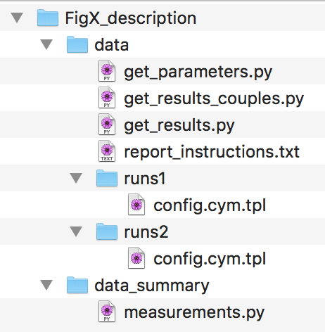
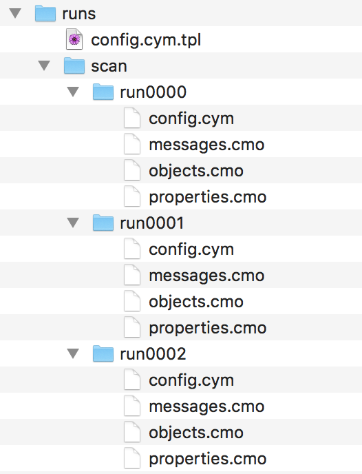
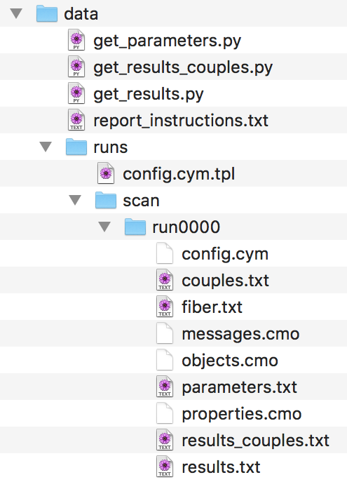
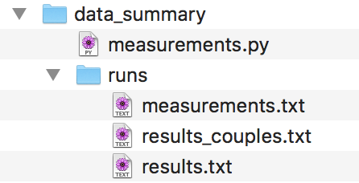

# Overview

This folder contains all the Cytosim configuration files necessary to replicate the simulation results shown in 
 The paper "Theory of antiparallel microtubule overlap stabilization by motors and diffusible crosslinkers".
 
The simulation can be run using the [Open Source software Cytosim](https://github.com/nedelec/cytosim).

Note that due to the stochastic nature of the simulation, your results will not be identical to the ones presented in the paper. 

# Template configuration files

To run simulations with varying parameters, we use a template file with extension `.cym.tpl`, from which multiple configuration files (extension `.cym`) are generated. 
For this we use the Python program [*Preconfig*](https://github.com/nedelec/preconfig), from the command line:
     
     preconfig.py config.cym.tpl

The template specifies parameters to vary, and how to vary them, which are reflected in the output.

For more information on *Preconfig*, please refer to [this article](https://openresearchsoftware.metajnl.com/articles/10.5334/jors.156):
 	
 	preconfig: A Versatile Configuration File Generator for Varying Parameters
	Journal of Open Research Software, 2017 5(1), p.9.
# Setup before running simulations
### Compilation of Cytosim

XXXXXXXXXXX

### Requited python modules
Python files are written in python 2. In order to run the python code you will need the following python modules:

	argparse
	joblib
	matplotlib
	numpy
	pandas
	scipy

	
We have bundled the required python scripts to run the code in a module called `leraramirez2019`. To run the different versions of `get_parameters.py`, one needs to import `read_config.py` from this module.

To allow this, you can either:

1. Copy the folder `code/python/leraramirez2019` to any of the directories in your python path. To check which directiories are in your python path, you can run (in python):

		import sys
		print sys.path

	You can copy `leraramirez2019` in any of the listed folders.

2. Copy `leraramirez2019` to all the folders were `get_parameters.py` is present.

### Setting relevant paths

If you want to use the scripts to analyse and run simulations (described in the section *Running and analyzing using a script.* below), you need to define some absolute paths in the first lines of the file `/code/bash/run_all.sh`:

1. `bin_folder`: The folder with the cytosim binaries, by default at `code/cytosim/bin`
2. `python_folder`: The path to the python module, by default at `code/python/leraramirez2019`
3. `python_bin`: Your Python 2 binary file.

# Simulation pipeline

Typically, the simulation process goes in three steps: running, measuring, and plotting the results. We describe how to proceed through these steps in order to reproduce the figures of the paper. Simulation folders are organised accordingly, and new files and folders are added as the pipeline progresses. We provide images of how the file organisation should evolve. To run the simulations for each of the figures, the starting point is a folder named `simulations/Fig*/data`.

In that folder there is:

* `runs*`: directories containing a template file `config.cym.tpl`. When running `preconfig.py`, on each template file, individual configuration files for simulations are generated in which parameters are scanned.
* `report_instructions.txt`: a file containing the instructions for the `report` binary from cytosim, to print information from the ran simulations (see below).
* `get_*.py` python scripts. They extract information from the simulation folders, after `report` has generated text files (see below).

## Running the simulations

1. **Creating configuration files:**  from the template file, we move to the `runs*` directory, and create several configuration files for each condition. This is done using preconfig:

		python preconfig.py N config.cym.tpl
		
	Where `N` is the number of desired configuration files per condition.
		
2. 	**Sorting configuration files:** we sort the generated files, named `config%04i.cym` in directories named `scan/run%04i`, and rename the config files to `config.cym`. The result is a tree of directories containing the individual configuration files: `scan/run%04i/config.cym`.

3. **Running simulations:** we call the binary `sim` in each of the directories, to run a simulation corresponding to each configuration file. This generates the simulation files `objects.cmo`, `properties.cmo`, and `messages.cmo`.

## Analyzing the simulations

1. **Extract the input parameters of each simulation:** For each simulation, we want to extract the relevant input parameters to text files. For that we use the python script `get_parameters.py` inside the simulation folder. We run:

		python get_parameters.py > parameters.txt

	For each figure, the parameters to be extracted are slightly different. Read the python script to see what exactly is being extracted. The file `parameters.txt` will contain a first row with the names of the parameters, and a second row with the values.

2. **Report information from simulation files:** for each simulation folder, we use the `report` binary to print the relevant information to text files. The arguments for report that we use for each figure are stored in the file `report_instructions.txt`. Typically, for the simulations of the paper we want to know for each time point of the simulation, how many crosslinkers and motors are bound, and the distance between minus ends. For this, we use:
		
		report couples > couples.txt
		report fiber:end > fiber.txt

	And  print those results into text files inside each of the simulation folders.

3. **Process the reported information:** the output of `report` has to be post-processed. This is done with python scripts named `get_*.py`, typically `get_results.py` and `get_results_couples.py`. We can call this python scripts in each of the simulation folders, and store the information in text files:

		python get_results.py > results.txt
		python get_results_couples.py > results_couples.txt

	`get_results.py` for most figures prints a single text line containing the distance between minus ends of the filaments for each simulation time point, separated by spaces.
	
	 `get_results_couples.py` prints a single text line containing the number of double bound couples (crosslinkers and/or motors depending on the figure).

	

4. **Gather information into a single text file**: It is not practical to have the results and parameters in scattered files. To gather the information, we create a directory, `simulations/Fig*/data_summary/runs*`, in which we create three files, `results.txt`, `results_couples.txt` and `parameters.txt`, which contain one line for each simulation. In order to create them, for each simulation folder:
		
		# For results and results_couples
		'/bin/cat results.txt >> simulations/Fig*/data_summary/runs*/results.txt'
		
		# For parameters, to keep only one line with column names
		# In the first folder
		'/bin/cat parameters.txt >> simulations/Fig*/data_summary/runs*/parameters.txt'
		# In the rest of the folders
		'/usr/bin/tail -n1 parameters.txt >> simulations/Fig*/data_summary/runs*/parameters.txt'
5. **Measure derived quantities:** Finally, we want to measure some derived quantity beyond what we have reported from simulation snapshots. For instance, the speed of sliding or average number of bound motors/crosslinkers at steady state. For this, we use the python script `simulations/Fig*/data_summary/measure.py`, which is slightly different for each figure. The results are saved in the file `simulations/Fig*/data_summary/runs*/measurements.py`, where column names are provided, and every line corresponds to a simulation.

	
	
### Running and analyzing using a script.

The previously described pipeline is written into a bash script, that can be found in `/code/bash/run_all.sh`. Keep in mind that to run this script the organisation of the folders provided is important, since certain commands rely on the relative paths to other files. Also, check the section *Setup before running simulations* and comments in the script before you try it.

The usage is explained by calling

	bash run_all.sh -h

## Plotting the figures

The python scripts to generate the figures are located in `simulations/figures_combined/`.

In this directory there is also other files:

* `data_lanksy.csv`: data from Figure 3B of Lansky et al. 2015.
* `plot_settings.py`: python file with settings for the plotting
* `theory_equations.py`: python functions corresponding to the analytical and numerical solutions presented in the text 